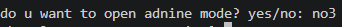
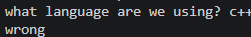
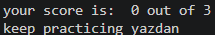

# Game Review Saver


A simple game review program built with Python

## Table of Contents

- [Features](#features)
- [Project Structure](#project-structure)
- [Requirements](#requirements)
- [Installation](#installation)
- [Environment Setup](#environment-setup)
- [Usage](#usage)
- [Example Output](#example-output)
- [Roadmap](#roadmap)
- [Contributing](#contributing)
- [License](#license)
- [Author](#author)
- [ Screen shot](#screenshot)
## Features

- Asks the user for their name
- Asks for the game name
- Gets a game rating from 1 to 5
- Gets a short game review
- Checks user input
- Saves reviews to a text file
- Uses `.env` for the admin password
- Includes an admin mode

## Project Structure

F:.
│   .env
│   .env.example
│   .gitignore
│   amirali.readme.md
│   app.log
│   eror.log
│   game_reviews.py
│   game_reviews.txt

### File Description
| file | description|
| ---| ---|
| `main.py` | Main file used to run the game review program
| `question.py` | Stores the questions
| `game_reviews.txt` | Stores game reviews
| `.env.example` | Shows the environment variables needed by the project
| `README.md` |Project documentation|
| `pictures/` | stores project screen shot| 
| `pictures/` | stores project screen shot| 
| `pictures/` | stores project screen shot| 
| `pictures/1` | stores project screen shot| 
| `pictures/2` | stores project screen shot| 
| `pictures/3` | stores project screen shot| 
## Requirements

- Python 3
- python-dotenv

## Installation
1. open a terminal in the project
2. check that python is installed:
```bash
python --version
```
3. install python packages
```bash
pip install -r requirments.txt
``
## Environment Setup

Create a `.env` file from `.env.example`:
```bash
cp .env.example .env
```
2. open the new `.env` file
3. replace the example with your own password
Add the admin password:

quiz_admin_password=your_password

Add `.env` to `.gitignore` to keep the password private.

## Usage
open the terminal

Run the quiz game
```bash
python main .py
```
3. choose `yes` or `no` for admin mode
4. if you choose `yes`,enter the password from your `.env`
5. enter your name
6. answer the question

python main.py

The program asks for:

- Your name
- Game name
- Game rating from 1 to 5
- A short review

The review is then saved in `game_reviews.txt`.

## Example Output
```text
What is your name? Amir
correct

Game name: Minecraft
correct

Rate this game from 1 to 5: 5
correct

Write a short review: This game is very fun
correct

Your review was saved
```

## screen shot


### game

()
### quiz

()


### final

()


## demo
! [quiz game demo](Animation.gif)

## Roadmap

- [x] add multiple quiz question
- [x] calculate the final score
- [x] save rusults to a file
- [x] add admin mode
- [ ] add more quiz
## Contributing


## License


## Author

create by [AmirAli Sharifi]( https://github.com/amirali-sh88)


